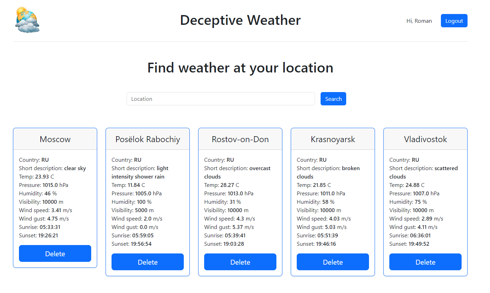

# ПРОЕКТ "ПОГОДА"

_Веб-приложение - трекер_ для просмотра текущей погоды.

_Функциональность:_
Приложение отображает погоду для выбранных пользователем локаций.
Для отображения локаций пользователю необходимо зарегистрироваться с произвольным логином, выбрать через поиск и подписаться на необходимые для него локации, после чего прогноз погоды для выбранных локаций будет отображаться на главной странице.

Данные прогноза запрашиваются у сервиса OpenWeatherMap (https://openweathermap.org/) по API.
